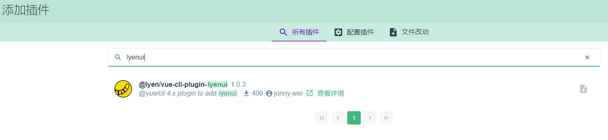
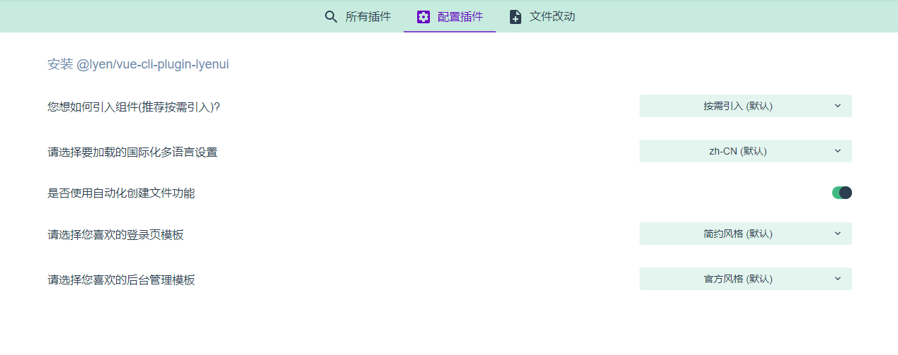

# vue-cli-plugin-lyenui

基于 `@vue/cli` 4.x 的插件，用于使用 element-ui 快速构建定制化的中后台管理系统。

### 安装

首先您需要全局安装 `@vue/cli`.

```bash
npm i @vue/cli -g
```

然后创建一个工程并添加本插件

```bash
vue create your-app-name
cd your-app-name
vue add @lyen/lyenui
```
您将被问到一些有关如何在项目中配置 lyenui 的问题，配置完之后，基于 lyenui 的一个 vue 项目就创建好了。

### 和 vue-cli UI 一起使用

如果您已完上述 **安装** 中的所有操作，请跳过此部分。

如果您更喜欢在 vue-cli UI 中管理项目（通过运行vue ui），则可以通过以下方法添加本插件：转到“插件”菜单，单击右上角的+ Add plugin(添加插件)按钮，找到 @lyen/vue-cli-plugin-lyenui 并安装它。如图：



安装后，在配置插件中配置，如图：



项目安装完毕依赖后，启动：

```bash
npm run serve 
```

具体操作以及其他事项详见 [docs 文档](http://10.3.0.126/luidocs/#/zhe-CN)
